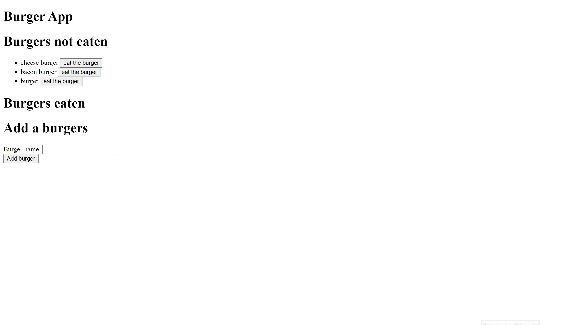

# burger

I want to make an app that allows the user to enter names of burgers.

- I want to create a form that allows the user to enter a name of a burger
- I want to create an add burger button
- When the user clicks on the add burger buttton it add burger to not eaten list
- I want to attach an eat burger button to each burger
- When the user clicks on the eat burger button it moves burger to eaten list

project website: https://lit-dawn-18330.herokuapp.com/

